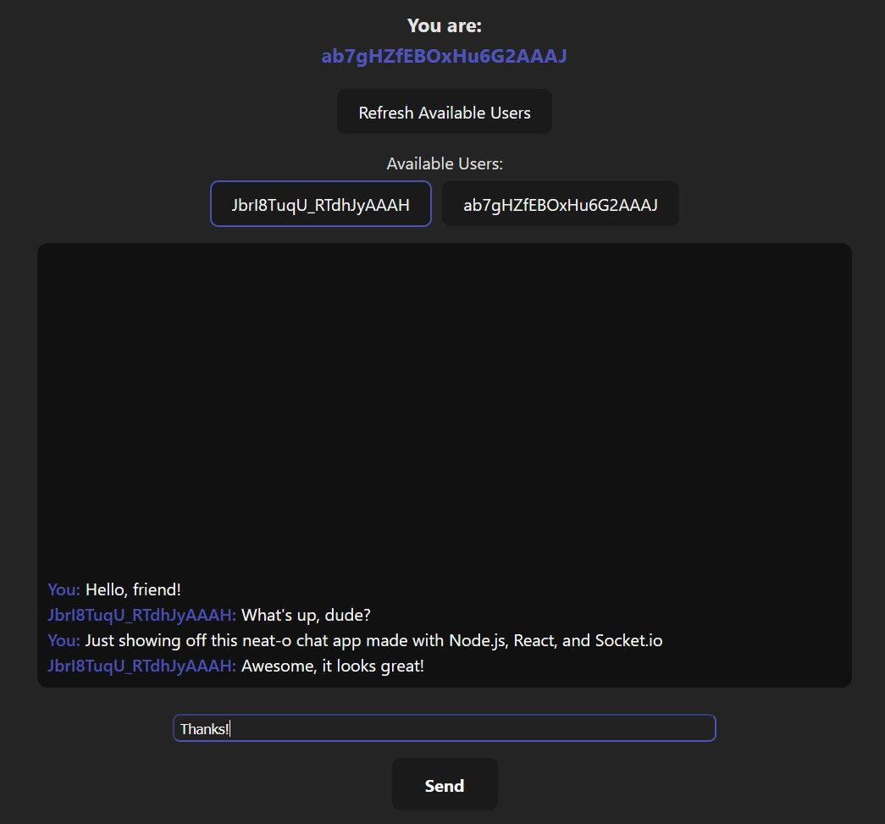

# Localhost Chat Application
## Made with Express.js, React, and Socket.io

### Description:
 A chat app using a Node.js server to pass messages to and from a series of browser-based React applications via localhost ports. Networking done using the Socket.io library. Server app uses Express.js to stand up a local server.

### Important Info:
- **Server:**
    - Everything is done through the index.js app
    - To run, use the following commands:
        - "npm install" (only need to run this the first time)
        - "node index.js"

- **Client:**
    - Pretty much everything is done through the /src/App.jsx file.
        - ButtonList.jsx is used to display the buttons for all available users, but does not handle any Networking
    - To run, use the following commands:
        - "npm install" (only need to run this the first time)
        - "npm run dev" 
        - Then simply navigate to "localhost:5173" in the browser of your choice (tested with MS Edge and Firefox)

## Server App Preview Image:

These are example outputs for all five of the possible server events:  
1. Server startup  
    - Always starts at localhost:3000 unless the index.js file in the server app is changed.
2. New User Connected 
    - Assigns the user a unique ID.  
3. An initial connection message from a client to the server 
    - Print's the client's IP address and the message before echoing back the message along with their unique user ID
4. A message from a client to another client
    - In this example a user is messaging themselves, but users can, of course, message other users.
5. A user disconnecting from the server.
    - User removed from list of active users and their unique user ID is re-added to the list of available IDs for when a new user connects.
   

## Client App Preview Images:

Starting page. Press the "Connect to Server" button to make a connection attempt to the server at localhost:3000.
   

Confirm the connection by sending a message to the server. Server echoes back the message and assigns a unique user ID to our client instance.
   

We now have our unique userID and are ready to talk to other users. Press the "Get Available Users" button to get the list of all currently connected users.
   

Once we've gotten all of the active users, a list of buttons appears with the user IDs of each of those users. Clicking on a user's button starts a new conversation with that user. There is also a button for ourselves because sometimes you're your own best friend. This is an example showing us messaging ourselves.
   

We can, of course, talk to people other than ourselves. Here's an example of a conversation between us and another user. Messages appear near-instantly and show the user ID of the sender. Messages can only be sent to one user at a time.
   